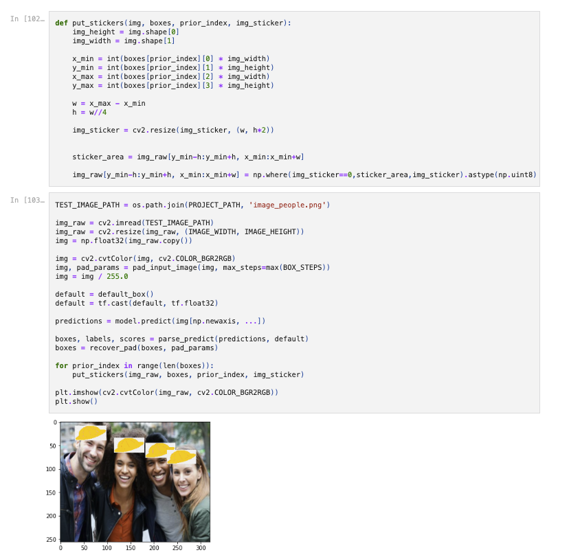
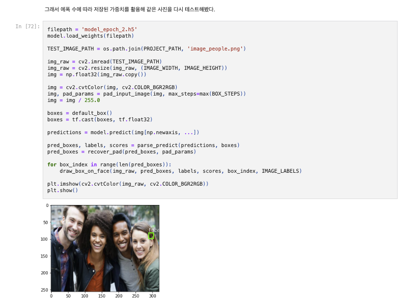

# AIFFEL Campus Online Code Peer Review
- 코더 : 김수진
- 리뷰어 : 정호재

# PR(Peer Review)
- [X]  **1. 주어진 문제를 해결하는 완성된 코드가 제출되었나요?**
    - 3개가지 루브릭 모두 충족하였습니다.  
        1. multiface detection을 위한 widerface 데이터셋의 전처리가 적절히 진행되었다. -> O. 
        2. SSD 모델이 안정적으로 학습되어 multiface detection이 가능해졌다. -> O
        3. 이미지 속 다수의 얼굴에 스티커가 적용되었다. -> O
    
- [X]  **2. 전체 코드에서 가장 핵심적이거나 가장 복잡하고 이해하기 어려운 부분에 작성된 
주석 또는 doc string을 보고 해당 코드가 잘 이해되었나요?**
    put_sticker 함수를 이용하여 원본 이미지에 스티커 이미지를 붙이도록 만들었습니다.  
      
        
- [X]  **3. 에러가 난 부분을 디버깅하여 문제를 “해결한 기록을 남겼거나” 
”새로운 시도 또는 추가 실험을 수행”해봤나요?**
   Epoch 초반의 weights들로 추론 결과를 확인하여 학습 상태를 확인하였습니다.  
       
        
- [X]  **4. 회고를 잘 작성했나요?**  
       
        
- [X]  **5. 코드가 간결하고 효율적인가요?**  
    put_sticker 함수를 이용하여 스티커 붙이기를 효율적으로 구현하였습니다.
