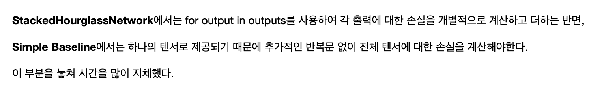
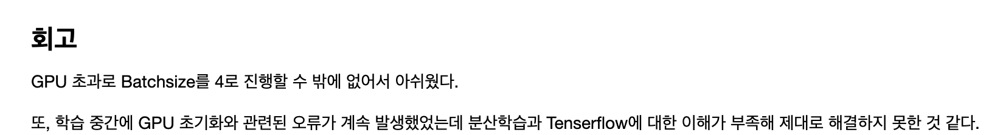

# AIFFEL Campus Online Code Peer Review
- 코더 : 김수진
- 리뷰어 : 정호재

# PR(Peer Review)
- [X]  **1. 주어진 문제를 해결하는 완성된 코드가 제출되었나요?**    
    -1. tfrecord를 활용한 데이터 셋 구성과 전처리를 통해 프로젝트 베이스라인 구성을 확인하였다. -> O
    -2. simplebaseline 모델을 정상적으로 구현하였다  -> O  
    -3. 두 모델의 비교분석한 결과를 체계적으로 정리하였다 -> 세모  ( 두 모델 간 비교를 학습 시간 측면에서 비교하시면 더 좋을 것 같아요.)  
    
- [ ]  **2. 전체 코드에서 가장 핵심적이거나 가장 복잡하고 이해하기 어려운 부분에 작성된 
주석 또는 doc string을 보고 해당 코드가 잘 이해되었나요?**  
    - 함수에 대한 주석 처리가 없습니다. 작성하시면서 코드를 이해하시면 좋을 것 같아요.  
        
- [X]  **3. 에러가 난 부분을 디버깅하여 문제를 “해결한 기록을 남겼거나”   
”새로운 시도 또는 추가 실험을 수행”해봤나요?**  
     - Compute Loss 부분이 simplebaseline 모델에 적합하지 않는다는 것을 찾아내셨습니다.    
       
        
- [X]  **4. 회고를 잘 작성했나요?**    
    - GPU 분산학습에 대해서 공부를 더 해야겠다고 하셨습니다.    
       
    
        
- [X]  **5. 코드가 간결하고 효율적인가요?**  